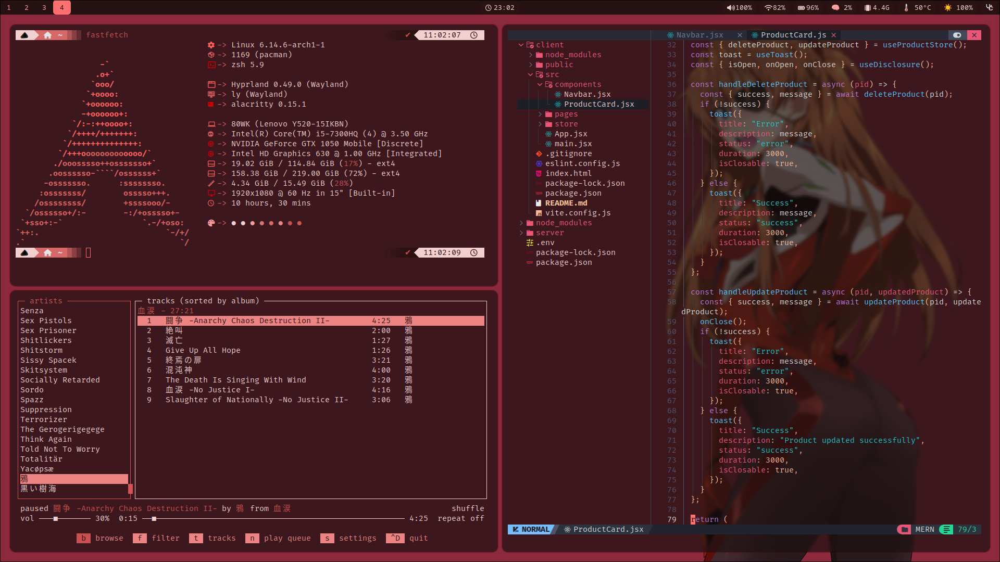
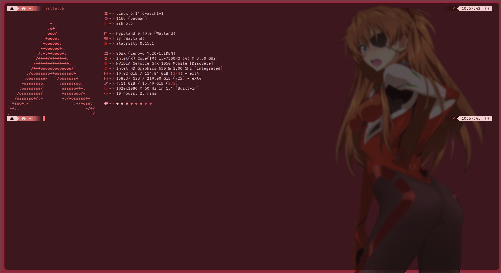
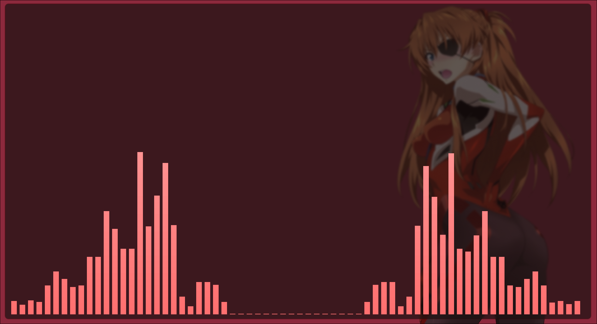
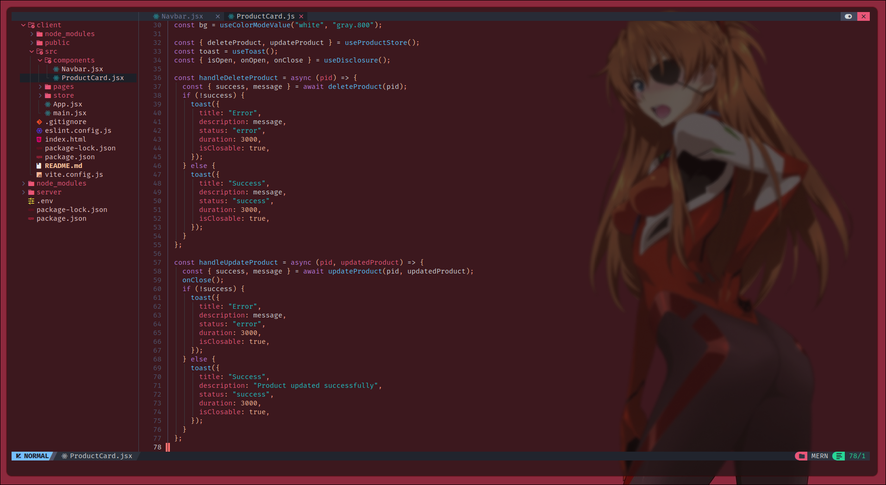
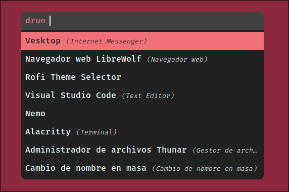
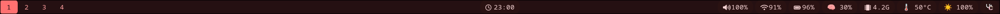

# Dotfiles para Setup en Arch + Hyprland

Este repositorio contiene mis configuraciones personalizadas (dotfiles) para un entorno basado en Arch Linux con el gestor de ventanas Hyprland.

La mayoría de los atajos de teclado (hotkeys) se mantienen por defecto.  
Los principales ajustes en la configuración de Hyprland incluyen:  
- Definición del wallpaper  
- Resolución y escalado 1.0  
- Configuraciones necesarias para asegurar compatibilidad y buen funcionamiento de aplicaciones basadas en Electron  

---

## Imágenes de Referencia

### General

### Alacritty + Fastfetch

### Cava

### Neovim (NVim)

### Rofi

El tema de Rofi utilizado en esta configuración fue tomado de la colección de temas disponible en [rofi-themes-collection](https://github.com/newmanls/rofi-themes-collection) por newmanls.

### Waybar

